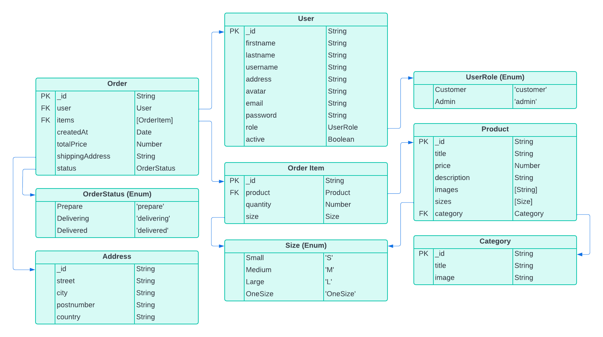
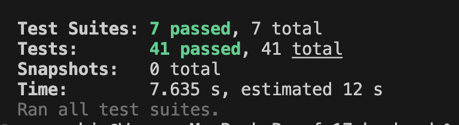

<a name="intro"></a>
# Fullstack E-commerce Backend
   This is a backend part of Fullstack project at Intergify 2024.<br />
   This backend provides a bunch of APIs to accomodate nice features in E-commerce transactioins with data saved in MongoDB.

   Basically try to mimic the E-commerce site and make the site fully functional both frontend and backend side in my own way.<br />
   Simulate the way of Payment, Mailing, Hosting Images, Authenticate, Google account login etc.

   I enjoyed the project with full of joy and also with lots of obstacles, but really had fun!  

   Check out the result here <br />
   Frontend: [https://cool-awsome-shopping.netlify.app](https://cool-awsome-shopping.netlify.app) <br/>
   Backend: [https://fs17-fullstack.onrender.com/api/v1/products](https://fs17-fullstack.onrender.com/api/v1/products)

<a name="table_of_contents"></a>
## Table of Contents
   - [Introduction](#intro)
   - [Table of Contents](#table_of_contents)
   - [Data Structure](#data_structure)
   - [Getting Started](#getting_started)
      - [Prerequisites](#prerequisites)
      - [Clone the project](#clone)
      - [Set environment variables](#setEnv)
      - [Install and run](#install)
      - [Navgiate](#navigate)
   - [Usage](#usage)
      - [Features](#features)
      - [Additional Features](#additional_features)
      - [Architecture and Design](#architecture_design)
      - [Testing](#testing)
      - [Deployment](#deployment)

<a name="data_structure"></a>
## Data structure
   

Entities
   - Users
   - Products
   - Categories
   - Orders
   - OrderItems

Enums
   - Size
   - OrderStatus
   - UserRole

<a name="getting_started"></a>
## Getting started
   <a name="prerequisites"></a>
   ### Prerequisites
   - node `^19.2.0`
   - npm `^9.2.0`

   Make sure you have [npm](https://www.npmjs.com/get-npm) installed globally.

   <a name="clone"></a>
   #### 1.Clone the project:
   ```bash
      $ git clone https://github.com/Woongsik/fullstack-e-commerce-api.git
      $ cd fullstack-e-commerce-api
   ```

   <a name="setEnv"></a>
   #### 2. Set envrionment variables 
   Check the `.envExample` file and set variables into `.env`<br />
   !Important _This should be done to run the the app_

   <a name="install"></a>
   #### 3.Install and run:
   ```bash
   $ npm install    # Install project dependencies
   $ npm run start  # Compile and launch on local environment
   ```

   <a name="navigate"></a>
   #### 4. Navigate to [http://localhost:{yourPortFromEnv}](http://localhost:8080)

<a name="usage"></a>
## Usage:
   <a name="script"></a>
   ### Scripts
   In the package.json, below scripts are used.<br />
   ```bash
      "scripts": {
         "start": "node dist/server.js",
         "dev": "nodemon --watch 'src/**/*.ts' --exec ts-node src/server.ts",
         "build": "tsc -p .",
         "test": "jest --runInBand --forceExit --detectOpenHandles --coverage  --verbose false"
      }
   ```
   
   <a name="features"></a>
   ### Features
   1. Products
      - Get list of all products with/without pagination(limit, offset)
      - Get list of products, filtering (search) by: title, categories, sizes, price range 
      - Get list of sorted products by createdAt, price, title (ASC, DESC)
      - Get a product by product id

   2. Categories
      - Get list of all categories
      - Get a category by category id

   3. Users
      - Sign up a new user (username, password, first name, last name, email, address)
      - Sign in user with email/password
      - Update user profile (username, first name, last name, address)
      - Update password (old password, new password)
      - Forget password request

   4. Order
      - Get list of all user's orders
      - Get a user's order by order ID

   5. Admin 
      - Create a new product and update, remove
      - Create a new category and update, remove
      - Update a User role to Admin/Customer, 
      - Update a User active to Active/Inactive
      - Remove a user

   6. Files
      - Upload image to Cloudinary
      - Delete image from Cloudinary

  <a name="additional_features"></a>
  ### Additional Features
   1. Welcoming email by [Mailersend](https://www.mailersend.com/)
      - When new user is registered, welcoming email will be sent 
      - Wwhen user forget the password, reset password will be sent

   2. Image hosting by [Cloudinary](https://cloudinary.com/)
      - Upload image to cloudinary

   3. Payment by [Stripe](https://stripe.com/en-fi)
      - Simulate payment transaction 

   4. Google account login
      - User is able to login/registeration by google account
      - Welcoming email generate an initial password for plain email/passowrd login
   
   5. Admin 
      - The Admin role will be given only accpeted/registered email 
      - Other email will be registered as only Customer but can be changed by Admin
      - ie. `admin@mail.com` (only for test purpose in the project)

   <a name="architecture_design"></a>
   ### Architecture & Design:
      src
      ┣ assets
      ┃ ┗ images
      ┃ ┃ ┣ ERD.png
      ┃ ┃ ┗ test.png
      ┣ config
      ┃ ┣ email.ts
      ┃ ┗ passport.ts
      ┣ controllers
      ┃ ┣ util
      ┃ ┃ ┗ controllerUtil.ts
      ┃ ┣ adminController.ts
      ┃ ┣ categoriesController.ts
      ┃ ┣ filesController.ts
      ┃ ┣ ordersController.ts
      ┃ ┣ productsController.ts
      ┃ ┗ usersController.ts
      ┣ errors
      ┃ ┗ ApiError.ts
      ┣ middlewares
      ┃ ┣ adminCheck.ts
      ┃ ┗ apiErrorHandlerMiddleware.ts
      ┣ misc
      ┃ ┣ types
      ┃ ┃ ┣ Category.ts
      ┃ ┃ ┣ GoogleCredential.ts
      ┃ ┃ ┣ JwtPayload.ts
      ┃ ┃ ┣ Order.ts
      ┃ ┃ ┣ Passport.ts
      ┃ ┃ ┣ Password.ts
      ┃ ┃ ┣ Payment.ts
      ┃ ┃ ┣ Product.ts
      ┃ ┃ ┣ Size.ts
      ┃ ┃ ┣ Sort.ts
      ┃ ┃ ┗ User.ts
      ┃ ┗ utils
      ┃ ┃ ┗ AuthUtil.ts
      ┣ model
      ┃ ┣ AddressModel.ts
      ┃ ┣ CategoryModel.ts
      ┃ ┣ OrderItemModel.ts
      ┃ ┣ OrderModel.ts
      ┃ ┣ ProductModel.ts
      ┃ ┗ UserModel.ts
      ┣ routers
      ┃ ┣ adminRouter.ts
      ┃ ┣ categoriesRouter.ts
      ┃ ┣ filesRouter.ts
      ┃ ┣ orderRouter.ts
      ┃ ┣ productsRouter.ts
      ┃ ┗ usersRouter.ts
      ┣ services
      ┃ ┣ categoriesService.ts
      ┃ ┣ filesService.ts
      ┃ ┣ ordersService.ts
      ┃ ┣ productsService.ts
      ┃ ┗ usersService.ts
      ┣ .DS_Store
      ┣ app.ts
      ┗ server.ts
   <a name="testing"></a>
   ### Testing

   Total 41 tests, 7 suits succeeded

   - [Jest](https://jestjs.io/)
   - [Supertest](https://www.npmjs.com/package/supertest)
   - [MongoDB memory server](https://www.npmjs.com/package/mongodb-memory-server)
   
   <br />
   
   

      Tests
         - Controllers
            - categoriesController.test.ts
            - productsController.test.ts
            - usersController.test.ts
         - Middlewares
            - adminCheck.spec.ts
         - Services
            - categoreisService.test.ts
            - productsService.test.ts
            - usersService.test.ts


   Check test code in src/tests
   ```bash
   $ npm run test
   ```

   <a name="architecture_design"></a>
   ### Deployment
   The API is live now hosted by [AMAZON EC2](https://aws.amazon.com/pm/ec2) and [RENDER](https://render.com/)
   For the best practice, I deployed it to both.

   - Amazon
     - Check the live link here [From EC2 instance](http://ec2-13-60-36-38.eu-north-1.compute.amazonaws.com:8080)
     - Some examples
       - [All products](http://ec2-13-60-36-38.eu-north-1.compute.amazonaws.com:8080/api/v1/products)
       - [All categories](http://ec2-13-60-36-38.eu-north-1.compute.amazonaws.com:8080/api/v1/categories)

   - Render
     - Check the live link here [From Render instance](https://fs17-fullstack.onrender.com)
     - Some examples
       - [All products](https://fs17-fullstack.onrender.com/api/v1/products/api/v1/products)
       - [All categories](https://fs17-fullstack.onrender.com/api/v1/categories)
   
   Other features requires authenticate via login/register 